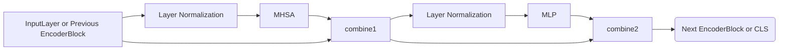

```mermaid
graph LR
    input[InputLayer or Previous EncoderBlock] --> LayerNorm1
    LayerNorm1[Layer Normalization] --> MHSA
    MHSA --> combine1
    input --> combine1
    combine1 --> LayerNorm2[Layer Normalization]
    LayerNorm2 --> MLP
    MLP --> combine2
    combine1 --> combine2
    combine2 --> Output(Next EncoderBlock or CLS)
    
```