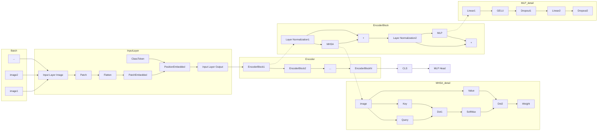

```mermaid
graph LR
    image1 --> InputImages
    image2 --> InputImages
    image3 --> InputImages
    InputLayerOutput --> EncoderBlock1
    EncoderBlock1 --> EncoderBlock2
    EncoderBlock2 --> EncoderBlock3
    EncoderBlock1 -.-> LayerNorm1
    EncoderBlock3 --> EncoderBlockN

    EncoderBlockN --> CLS
    CLS --> MLPHead[MLP Head] 

    InputImages --> Patch
    Patch --> Flatten
    Flatten --> PatchEmbedded
    PatchEmbedded --> PositionEmbedded
    ClassToken --> PositionEmbedded
    PositionEmbedded --> InputLayerOutput[Input Layer Output]

    LayerNorm1 --> MHSA
    MHSA --> plus1
    LayerNorm1 --> plus1
    plus1 --> LayerNorm2
    
    MHSA -.-> image
    image --> Query
    image --> Key
    image --> Value
    Query --> Dot1
    Key --> Dot1
    Dot1 --> SoftMax
    SoftMax --> Dot2
    Value --> Dot2
    Dot2 --> Weight


    LayerNorm2 --> MLP
    LayerNorm2 --> plus2
    MLP --> plus2
    MLP -.-> Linear1

    Linear1 --> GELU
    GELU --> Dropout1
    Dropout1 --> Linear2
    Linear2 --> Dropout2

    subgraph InputLayer
        InputImages[Input Layer Image]
        Patch
        Flatten
        PatchEmbedded
        ClassToken
        PositionEmbedded
        InputLayerOutput
    end

    subgraph Encoder
        EncoderBlock1
        EncoderBlock2
        EncoderBlock3[...]
        EncoderBlockN
    end

    subgraph EncoderBlock
        LayerNorm1[Layer Normalization1]
        MHSA
        plus1[+]
        LayerNorm2[Layer Normalization2]
        MLP
        plus2[+]
    end

    subgraph MHSA_detail
        image
        Query
        Key
        Value
        Dot1
        Dot2
        SoftMax
        Weight
    end 
    subgraph MLP_detail
        Linear1
        GELU
        Dropout1
        Linear2
        Dropout2
    end

    subgraph Images[Batch]
        image1
        image2
        image3[...]
    end
```