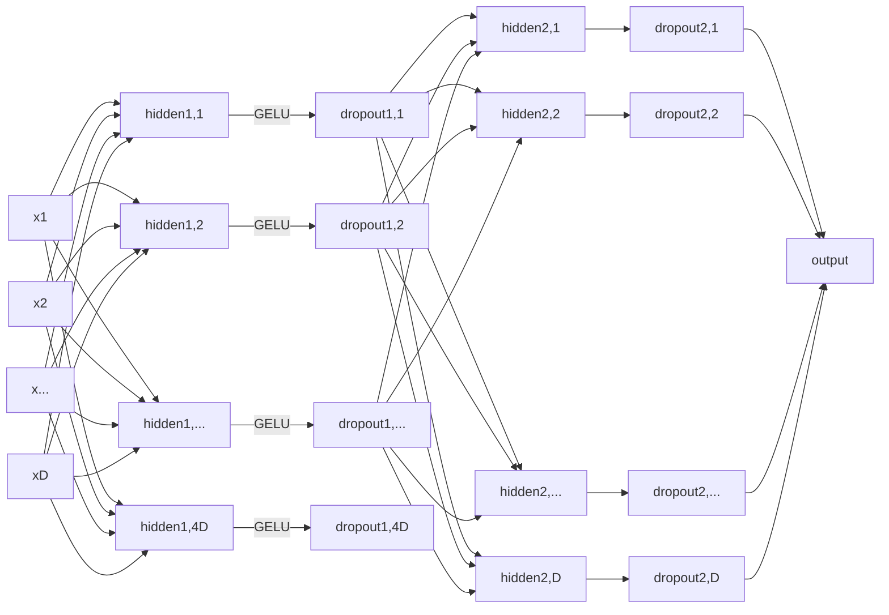

```mermaid
graph LR
    x1 --> hidden1,1
    x2 --> hidden1,1
    x... --> hidden1,1
    xD --> hidden1,1
    x1 --> hidden1,2
    x2 --> hidden1,2
    x... --> hidden1,2
    xD --> hidden1,2
    x1 --> hidden1,...
    x2 --> hidden1,...
    x... --> hidden1,...
    xD --> hidden1,...
    x1 --> hidden1,4D
    x2 --> hidden1,4D
    x... --> hidden1,4D
    xD --> hidden1,4D
    hidden1,1 -->|GELU| dropout1,1
    hidden1,2 -->|GELU| dropout1,2
    hidden1,... -->|GELU| dropout1,...
    hidden1,4D -->|GELU| dropout1,4D
    dropout1,1 --> hidden2,1
    dropout1,1 --> hidden2,2
    dropout1,1 --> hidden2,...
    dropout1,1 --> hidden2,D
    dropout1,2 --> hidden2,1
    dropout1,2 --> hidden2,2
    dropout1,2 --> hidden2,...
    dropout1,2 --> hidden2,D
    dropout1,... --> hidden2,1
    dropout1,... --> hidden2,2
    dropout1,... --> hidden2,...
    dropout1,... --> hidden2,D
    hidden2,1 --> dropout2,1
    hidden2,2 --> dropout2,2
    hidden2,... --> dropout2,...
    hidden2,D --> dropout2,D
    dropout2,1 --> output
    dropout2,2 --> output
    dropout2,... --> output
    dropout2,D --> output
```