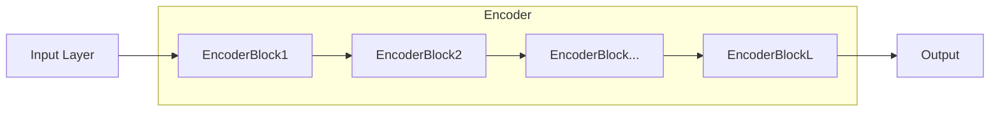

```mermaid
graph LR
    
    input["Input Layer"] --> EncoderBlock1
    subgraph Encoder
        EncoderBlock1 --> EncoderBlock2
        EncoderBlock2 --> EncoderBlock...
        EncoderBlock... --> EncoderBlockL
    end

    EncoderBlockL --> Output
```