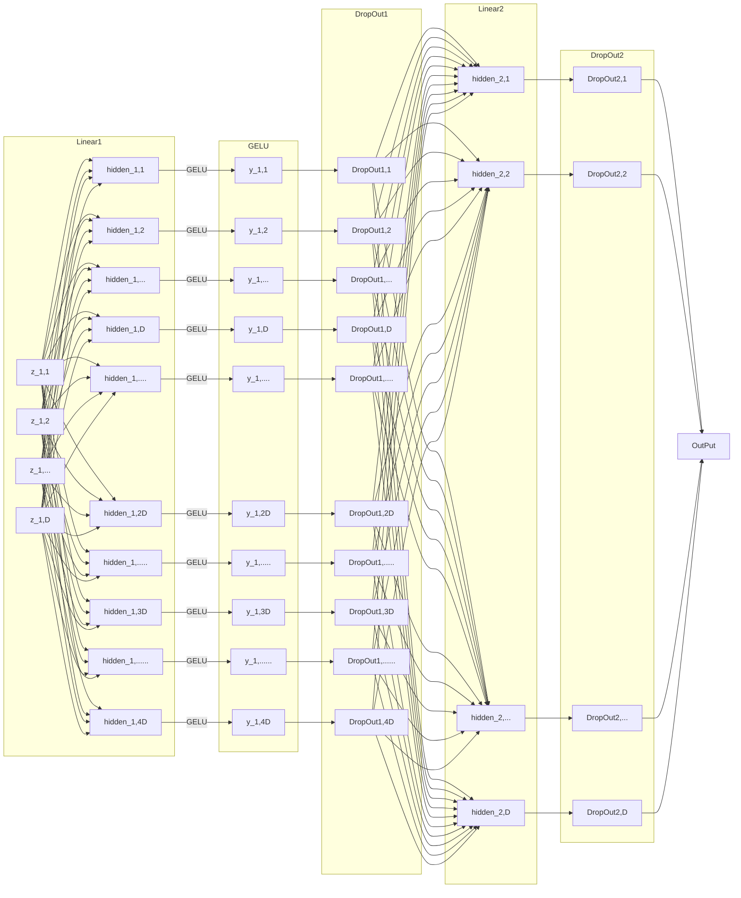

```mermaid
graph LR    
    subgraph Linear1
        z_1,1 --> hidden_1,1
        z_1,1 --> hidden_1,2
        z_1,1 --> hidden_1,...
        z_1,1 --> hidden_1,D
        z_1,1 --> hidden_1,....
        z_1,1 --> hidden_1,2D
        z_1,1 --> hidden_1,.....
        z_1,1 --> hidden_1,3D
        z_1,1 --> hidden_1,......
        z_1,1 --> hidden_1,4D

        z_1,2 --> hidden_1,1
        z_1,2 --> hidden_1,2
        z_1,2 --> hidden_1,...
        z_1,2 --> hidden_1,D
        z_1,2 --> hidden_1,....
        z_1,2 --> hidden_1,2D
        z_1,2 --> hidden_1,.....
        z_1,2 --> hidden_1,3D
        z_1,2 --> hidden_1,......
        z_1,2 --> hidden_1,4D

        z_1,... --> hidden_1,1
        z_1,... --> hidden_1,2
        z_1,... --> hidden_1,...
        z_1,... --> hidden_1,D
        z_1,... --> hidden_1,....
        z_1,... --> hidden_1,2D
        z_1,... --> hidden_1,.....
        z_1,... --> hidden_1,3D
        z_1,... --> hidden_1,......
        z_1,... --> hidden_1,4D

        z_1,D --> hidden_1,1
        z_1,D --> hidden_1,2
        z_1,D --> hidden_1,...
        z_1,D --> hidden_1,D
        z_1,D --> hidden_1,....
        z_1,D --> hidden_1,2D
        z_1,D --> hidden_1,.....
        z_1,D --> hidden_1,3D
        z_1,D --> hidden_1,......
        z_1,D --> hidden_1,4D
    end

    subgraph GELU
        hidden_1,1 --GELU--> y_1,1 
        hidden_1,2 --GELU--> y_1,2
        hidden_1,... --GELU--> y_1,...
        hidden_1,D --GELU--> y_1,D
        hidden_1,.... --GELU--> y_1,....
        hidden_1,2D --GELU--> y_1,2D
        hidden_1,..... --GELU--> y_1,.....
        hidden_1,3D --GELU--> y_1,3D
        hidden_1,...... --GELU--> y_1,......
        hidden_1,4D --GELU--> y_1,4D
    end

    subgraph DropOut1
        y_1,1 --> DropOut1,1
        y_1,2 --> DropOut1,2
        y_1,... --> DropOut1,...
        y_1,D --> DropOut1,D
        y_1,.... --> DropOut1,....
        y_1,2D --> DropOut1,2D
        y_1,..... --> DropOut1,.....
        y_1,3D --> DropOut1,3D
        y_1,...... --> DropOut1,......
        y_1,4D --> DropOut1,4D
    end

    subgraph Linear2
        DropOut1,1 --> hidden_2,1
        DropOut1,1 --> hidden_2,2
        DropOut1,1 --> hidden_2,...
        DropOut1,1 --> hidden_2,D
        DropOut1,2 --> hidden_2,1
        DropOut1,2 --> hidden_2,2
        DropOut1,2 --> hidden_2,...
        DropOut1,2 --> hidden_2,D
        DropOut1,... --> hidden_2,1
        DropOut1,... --> hidden_2,2
        DropOut1,... --> hidden_2,...
        DropOut1,... --> hidden_2,D
        DropOut1,D --> hidden_2,1
        DropOut1,D --> hidden_2,2
        DropOut1,D --> hidden_2,...
        DropOut1,D --> hidden_2,D
        DropOut1,.... --> hidden_2,1
        DropOut1,.... --> hidden_2,2
        DropOut1,.... --> hidden_2,...
        DropOut1,.... --> hidden_2,D
        DropOut1,2D --> hidden_2,1
        DropOut1,2D --> hidden_2,2
        DropOut1,2D --> hidden_2,...
        DropOut1,2D --> hidden_2,D
        DropOut1,..... --> hidden_2,1
        DropOut1,..... --> hidden_2,2
        DropOut1,..... --> hidden_2,...
        DropOut1,..... --> hidden_2,D
        DropOut1,3D --> hidden_2,1
        DropOut1,3D --> hidden_2,2
        DropOut1,3D --> hidden_2,...
        DropOut1,3D --> hidden_2,D
        DropOut1,...... --> hidden_2,1
        DropOut1,...... --> hidden_2,2
        DropOut1,...... --> hidden_2,...
        DropOut1,...... --> hidden_2,D
        DropOut1,4D --> hidden_2,1
        DropOut1,4D --> hidden_2,2
        DropOut1,4D --> hidden_2,...
        DropOut1,4D --> hidden_2,D
    end

    subgraph DropOut2
        hidden_2,1 --> DropOut2,1
        hidden_2,2 --> DropOut2,2
        hidden_2,... --> DropOut2,...
        hidden_2,D --> DropOut2,D
    end

    DropOut2,1 --> OutPut
    DropOut2,2 --> OutPut
    DropOut2,... --> OutPut
    DropOut2,D --> OutPut
```