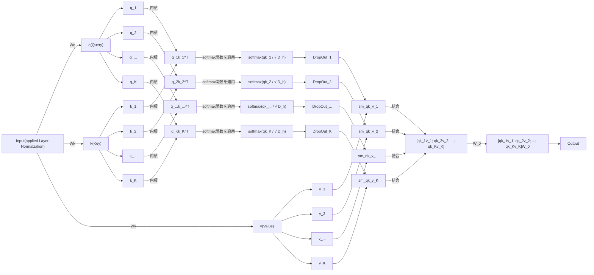

```mermaid
graph LR
    input["Input(applied Layer Normalzation)"] --Wq--> q["q(Query)"]
    input["Input(applied Layer Normalzation)"] --Wk--> k["k(Key)"]
    input["Input(applied Layer Normalzation)"] --Wv--> v["v(Value)"]

    q --> q_1
    q --> q_2
    q --> q_...
    q --> q_K

    k --> k_1
    k --> k_2
    k --> k_...
    k --> k_K

    v --> v_1
    v --> v_2
    v --> v_...
    v --> v_K

    q_1 --内積--> qk_1[q_1k_1^T]
    q_2 --内積--> qk_2[q_2k_2^T]
    q_... --内積--> qk_...[q_...k_...^T]
    q_K --内積--> qk_K[q_Kk_K^T]

    k_1 --内積--> qk_1[q_1k_1^T]
    k_2 --内積--> qk_2[q_2k_2^T]
    k_... --内積--> qk_...[q_...k_...^T]
    k_K --内積--> qk_K[q_Kk_K^T]

    qk_1 --"softmax関数を適用"--> sm_qk_1["softmax(qk_1 / √ D_h)"]
    qk_2 --"softmax関数を適用"--> sm_qk_2["softmax(qk_2 / √ D_h)"]
    qk_... --"softmax関数を適用"--> sm_qk_...["softmax(qk_... / √ D_h)"]
    qk_K --"softmax関数を適用"--> sm_qk_K["softmax(qk_K / √ D_h)"]


    sm_qk_1 --> DropOut_1
    sm_qk_2 --> DropOut_2
    sm_qk_... --> DropOut_...
    sm_qk_K --> DropOut_K

    DropOut_1 --> sm_qk_v_1
    DropOut_2 --> sm_qk_v_2
    DropOut_... --> sm_qk_v_...
    DropOut_K --> sm_qk_v_K

    
    v_1 --> sm_qk_v_1
    v_2 --> sm_qk_v_2
    v_... --> sm_qk_v_...
    v_K --> sm_qk_v_K

    sm_qk_v_1 --結合--> combine["[qk_1v_1; qk_2v_2; ...; qk_Kv_K]"]
    sm_qk_v_2 --結合--> combine
    sm_qk_v_... --結合--> combine
    sm_qk_v_K --結合--> combine

    combine --W_0--> transpose["[qk_1v_1; qk_2v_2; ...; qk_Kv_K]W_0"]

    transpose --> Output

    
```