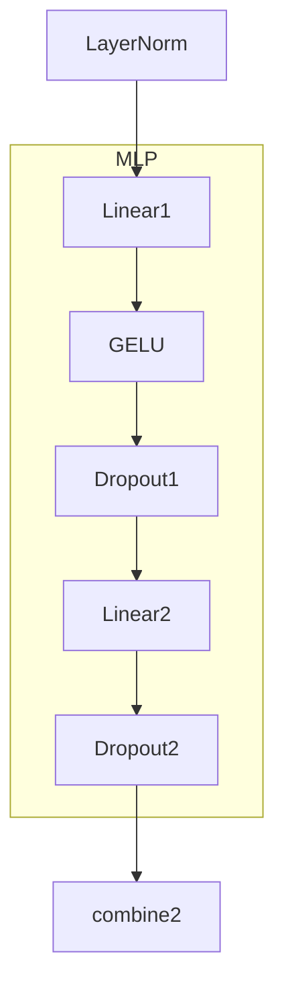

```mermaid
graph TD
    LayerNorm --> Linear1
    Linear1 --> GELU
    GELU --> Dropout1
    Dropout1 --> Linear2
    Linear2 --> Dropout2
    Dropout2 --> combine2

    subgraph MLP
        Linear1
        GELU
        Dropout1
        Linear2
        Dropout2
    end
```