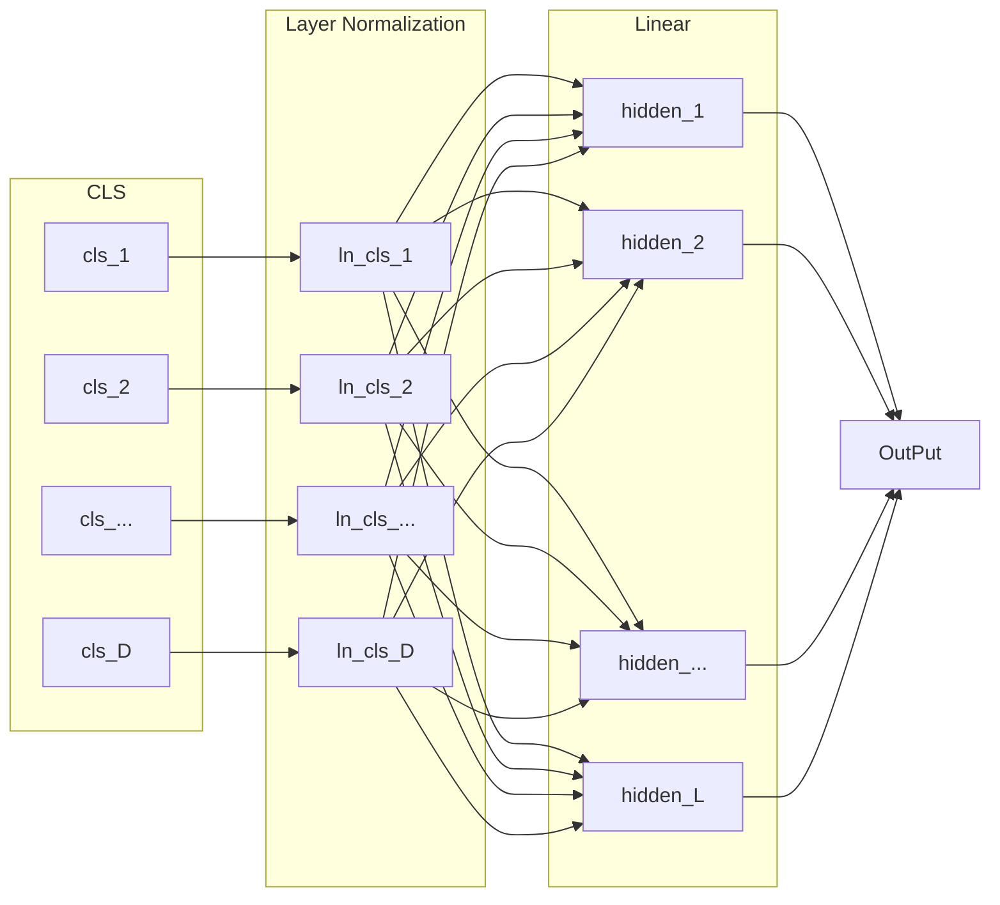

```mermaid
graph LR

    ln_cls_1 --> hidden_1
    ln_cls_2 --> hidden_1
    ln_cls_... --> hidden_1
    ln_cls_D --> hidden_1
    
    ln_cls_1 --> hidden_2
    ln_cls_2 --> hidden_2
    ln_cls_... --> hidden_2
    ln_cls_D --> hidden_2

    ln_cls_1 --> hidden_...
    ln_cls_2 --> hidden_...
    ln_cls_... --> hidden_...
    ln_cls_D --> hidden_...

    ln_cls_1 --> hidden_L
    ln_cls_2 --> hidden_L
    ln_cls_... --> hidden_L
    ln_cls_D --> hidden_L

    hidden_1 --> OutPut
    hidden_2 --> OutPut
    hidden_... --> OutPut
    hidden_L --> OutPut

    subgraph Linear
        hidden_1 
        hidden_2 
        hidden_...
        hidden_L
    end

    subgraph LayerNorm[Layer Normalization]
        ln_cls_1
        ln_cls_2
        ln_cls_...
        ln_cls_D
    end

    subgraph CLS
        cls_1 --> ln_cls_1
        cls_2 --> ln_cls_2
        cls_... --> ln_cls_...
        cls_D --> ln_cls_D
    end

```